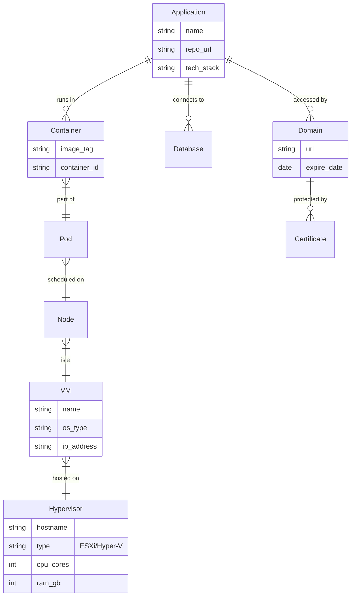

# 软件系统资产管理平台 - 功能设计方案

## 1. 系统定位
本系统旨在对企业的软件资产（应用、服务、中间件）及基础设施（云服务器、客户服务器）进行集中化管理。核心目标是**可视化资产关系**、**保障服务连续性**（防过期、防遗忘）以及**辅助运维决策**。

## 2. 核心功能模块

### 2.1 基础设施管理 (Infrastructure)
*仅记录承载软件运行的计算资源。*

*   **云服务器管理 (Cloud Instances)**
    *   **多云纳管**：支持阿里云、AWS、腾讯云等，记录实例 ID、区域 (Region)、可用区。
    *   **实例详情**：公网/内网 IP、配置 (vCPU/RAM/Disk)、操作系统版本。
    *   **生命周期**：创建时间、**到期时间**（预警）、计费方式（包年包月/按量）。
    *   **归属标签**：所属项目、环境（Prod/Test/Dev）、负责人。
*   **客户/物理服务器 (On-Premises/Customer)**
    *   **连接信息**：IP 地址、SSH 端口、跳板机/VPN 依赖信息。
    *   **物理属性**：机房位置、机柜号、硬件序列号（如需）、维保状态。
*   **虚拟化与容器平台 (Virtualization & Containers)**
    *   **虚拟化集群 (VMware/Hyper-V)**：
        *   纳管 vCenter/SCVMM，自动同步宿主机 (ESXi/Hyper-V Host) 与虚拟机 (VM) 的从属关系。
        *   记录资源超卖率、快照状态、存储卷 (Datastore) 使用情况。
    *   **容器环境 (Docker/K8s)**：
        *   **集群管理**：K8s Cluster 版本、节点池 (Node Pools)、命名空间 (Namespace) 配额。
        *   **镜像仓库**：对接 Harbor/DockerHub，扫描镜像漏洞 (CVE)，记录镜像 Tag 更新时间。
        *   **工作负载**：记录 Deployment/StatefulSet 与 Pod 的实时状态，关联 Service/Ingress 暴露的入口。

### 2.2 软件与应用资产 (Software & Applications)
*系统的核心对象，管理“我们要维护什么”。*

*   **应用服务清单 (Microservices & Apps)**
    *   **基本信息**：服务名称、唯一标识 (AppID)、代码仓库地址 (Git)、技术栈 (Java/Go/Node)。
    *   **部署实例**：记录该应用部署在哪些服务器上 (关联 2.1)，部署路径、运行端口、当前版本。
*   **中间件管理 (Middleware)**
    *   **数据库 (DB)**：MySQL/PG/Oracle 实例，记录连接地址 (Host:Port)、版本、用途、备份策略状态。
    *   **缓存/消息队列**：Redis、Kafka、RabbitMQ 等集群信息及连接参数。
*   **第三方服务 (SaaS/API)**
    *   记录依赖的外部 API（如短信网关、支付接口），包括账号信息、API Key（脱敏/引用）、配额限制。

### 2.3 网络与数字资产 (Network & Digital Assets)
*极易被忽视但至关重要的无形资产。*

*   **域名管理 (Domains)**
    *   **域名列表**：域名、注册商、**到期日**（强提醒）、DNS 解析服务商。
    *   **解析记录**：关键子域名及其指向 (A/CNAME)，关联到具体应用或负载均衡。
*   **SSL 证书管理 (Certificates)**
    *   **证书监控**：证书文件、颁发机构、**过期时间**（倒计时预警）、绑定的域名。
    *   **部署位置**：记录该证书部署在哪些 LB 或 Nginx 上，防止更新遗漏。
*   **虚拟IP (VIP) / 负载均衡 (SLB)**
    *   记录负载均衡器配置、监听端口及后端服务器组。

### 2.4 资产拓扑与关系 (Topology & Relations)
*解决“牵一发而动全身”的问题。*

*   **依赖关系映射**：
    *   `应用` -> 运行于 -> `服务器`
    *   `应用` -> 依赖 -> `数据库/Redis`
    *   `域名` -> 解析到 -> `负载均衡` -> 转发给 -> `应用`
*   **影响分析**：当某台服务器维护或宕机时，自动列出受影响的应用列表和负责人。

### 2.5 运维与安全辅助 (Ops & Security)
*   **账号/凭证索引**：不直接存储明文密码，但记录“访问该资产需要使用哪个密钥/账号”，集成 Vault 或 1Password。
*   **配置中心引用**：记录应用的配置文件存储位置（如 Nacos/Consul 地址或服务器本地路径）。
*   **变更日志**：记录谁在什么时候修改了资产信息（如服务器配置变更、应用版本更新）。

### 2.6 可视化关系图面板 (Visual Relationship Dashboard)
*提供直观的上帝视角，让复杂的依赖关系一目了然。*

*   **交互式拓扑图**
    *   **动态渲染**：基于 D3.js/G6/ECharts，实时渲染应用、服务器、数据库之间的连线。
    *   **操作支持**：支持节点拖拽、缩放、点击查看详情侧边栏。
    *   **自动布局**：提供力导向图、树状图等多种自动布局算法，避免节点重叠。
*   **多维度视图**
    *   **物理视图**：展示“机房 -> 机柜 -> 服务器 -> 虚拟机”的嵌套关系。
    *   **逻辑视图**：展示“域名 -> 负载均衡 -> 应用集群 -> 数据库”的调用链路。
*   **故障模拟与传导**
    *   **影响分析**：点击某个节点（如“核心数据库”），高亮显示所有依赖它的上游应用，快速评估故障爆炸半径。
    *   **健康状态叠加**：集成监控数据，节点颜色代表健康度（绿=正常，红=告警，灰=未知）。

### 2.7 数据导入与初始化 (Data Import & Onboarding)
*支持从现有的 Excel/CSV 资产台账快速迁移，降低初始化成本。*

*   **批量导入工具**
    *   **模板下载**：提供标准的 Excel 模板（包含资产、软件授权、账号密码等 Sheet 页）。
    *   **数据校验**：上传时自动检查必填项、格式错误（如 IP 地址格式）、重复记录。
    *   **增量更新**：支持“仅新增”或“覆盖更新”模式，方便定期同步外部数据。
*   **敏感信息处理**
    *   **账号密码导入**：在前端即时加密，或通过 HTTPS 传输，服务器端接收后立即加盐哈希存储（对于仅需验证的密码）或加密存储（对于需查看的凭证）。
    *   **导入日志**：记录导入时间、操作人、成功/失败条数及错误详情。

### 2.8 快捷访问与知识门户 (Quick Access & Knowledge Portal)
*不仅仅是记录资产，更是运维工作的“快捷启动器”和“说明书”。*

*   **一键连接 (One-Click Connect)**
    *   **服务器连接**：
        *   集成 Web Terminal (xterm.js)，点击服务器 IP 可直接唤起 SSH/Telnet 会话。
        *   支持 Windows RDP 连接（下载 `.rdp` 文件或 Web 代理连接）。
        *   自动填充凭证：后端自动调用已关联的账号密码，实现 SSO 体验（需严格权限控制）。
    *   **业务系统访问**：
        *   点击应用链接，自动在新标签页打开。
        *   若系统支持，自动复制测试账号/密码到剪贴板，或通过浏览器插件自动填入。
    *   **API 调试**：
        *   针对 API 接口资产，内嵌 Swagger/Postman 简化版界面。
        *   展示调用示例 (cURL/Python/JS)，并自动填入 API Key。
*   **资产知识库 (Contextual Knowledge)**
    *   **关联 Wiki**：每个资产详情页下方集成 Markdown 编辑区，记录“如何重启”、“常见报错处理”、“业务逻辑说明”。
    *   **文档索引**：上传或链接相关的架构图、部署手册、排障指南，与资产深度绑定。

### 2.9 权限控制与安全审计 (RBAC & Audit)
*借鉴 Windows 用户组与 Linux ACL 设计，实现精细化权限管理与全链路行为追踪。*

*   **多维权限体系 (RBAC + Resource Groups)**
    *   **角色 (Roles)**：定义“能做什么”。如 `Admin` (全权), `Operator` (重启/编辑), `Viewer` (只读), `Auditor` (仅审计日志)。
    *   **资源组 (Resource Groups)**：定义“能看到什么”。将资产按项目、部门或环境分组（如 `FinTech-Prod`, `OA-Dev`）。
    *   **授权策略**：`User A` 属于 `Operator` 角色，但仅限于 `OA-Dev` 资源组。
*   **全链路审计日志 (Audit Trails)**
    *   **操作审计**：记录 CRUD 操作（谁创建了服务器、谁修改了数据库连接串）。
    *   **访问审计**：记录敏感动作（谁查看了 Root 密码、谁发起了 SSH 连接、连接时长）。
    *   **数据留存**：日志接入 Elasticsearch/Loki，支持长期存储与合规导出。
*   **智能搜索与建议 (Smart Search)**
    *   **全文检索**：整合 ELK (Elasticsearch)，支持模糊搜索资产名称、IP、备注、Wiki 内容。
    *   **上下文建议 (Autocomplete)**：
        *   输入 `Pay` -> 自动提示 `App: Payment-Gateway`, `DB: Pay-Master`, `Interface: WeChat-Pay-API`。
        *   输入 `SSH` -> 自动列出最近访问过的服务器列表。
    *   **结构化过滤**：支持 `tag:production AND region:cn-hangzhou` 等高级语法。

### 2.10 智能风控与 SLA 评分 (Intelligent Risk Control & SLA)
*从“被动记录”转向“主动防御”，通过实时计算发现潜在风险。*

*   **业务健康分 (SLA Health Score)**
    *   **评分模型**：基础分 100 分。
        *   **可用性扣分**：监控系统检测到宕机一次扣 10 分。
        *   **合规性扣分**：存在未修复的高危漏洞扣 5 分/个，SSL 证书剩余有效期 < 7天扣 20 分。
    *   **低分预警**：当某业务系统健康分 < 60 分时，自动发送“SLA 违约风险日报”给产品经理和技术负责人。
*   **用户行为风险分 (UEBA Risk Score)**
    *   **高危行为定义**：
        *   **异地/异常时间登录**：非工作时间（如凌晨 3 点）登录或 IP 归属地突变（+20 分）。
        *   **敏感操作**：查看 Root 密码、导出全量数据、高频尝试连接失败（+30 分）。
    *   **自动熔断机制**：
        *   **风险阈值**：单日风险分 > 80 分。
        *   **触发动作**：自动暂时锁定账号，并通过钉钉/邮件**抄送其上级管理者**进行确认解锁。

## 3. 数据模型简述 (ER Diagram Concept)



## 4. 关键痛点解决方案
1.  **防过期**：系统每日自动扫描域名、证书、云主机到期时间，通过邮件/钉钉/企业微信提前 30 天、7 天发送告警。
2.  **资产孤岛**：通过应用视角串联服务器、域名和数据库，而不是孤立的 Excel 表格。
3.  **内鬼/黑客防御**：通过 UEBA 行为评分模型，识别非正常时间的敏感数据访问，并在造成重大损失前自动阻断。
4.  **人员离职交接**：按“负责人”筛选资产，一键导出交接清单。

## 5. 技术架构与交付方案 (Architecture & Delivery)

### 5.1 核心架构：微内核 + 插件化 (Micro-kernel + Plugins)
*设计目标：一套代码，同时满足 SaaS 多租户、私有化部署、社区版轻量级分发。*

*   **接入层 (Ingress)**
    *   **Nginx/OpenResty**：负责流量分发、SSL 卸载。SaaS 模式下根据 `Host` 头分发到不同租户逻辑。
*   **后端服务 (Backend)**
    *   **语言选型**：Golang (推荐) 或 Java (Spring Boot)。Golang 编译为单一二进制文件，极大简化私有化部署难度。
    *   **架构模式**：**模块化单体 (Modular Monolith)**。避免微服务带来的运维复杂度，但内部保持模块解耦。
*   **数据存储 (Storage)**
    *   **PostgreSQL**：主数据库，利用 JSONB 存储异构资产属性。
    *   **Redis**：缓存 Session、任务队列。
    *   **TimeScaleDB/Loki**：轻量级时序与日志存储（无需部署重型 ELK）。
    *   **Etcd**：分布式配置中心与元数据存储（类似 ZooKeeper，用于服务发现、动态配置强制下发）。

### 5.2 多租户与定制化 (Multi-Tenancy & Customization)
*   **多租户隔离 (SaaS)**：
    *   **逻辑隔离**：Database 表增加 `tenant_id` 字段，ORM 层自动注入过滤条件。
    *   **物理隔离**：VIP 客户支持独立 Schema 或独立 Database 实例。
*   **插件化扩展 (Plugin System)**：
    *   **Webhook/Event Bus**：核心系统发出标准事件（如 `AssetCreated`, `RiskDetected`），外部插件订阅处理。
    *   **Script Engine**：内嵌 Lua/Python 引擎，允许用户编写自定义巡检脚本（如“检查特定文件的 MD5 值”）。

### 5.3 交付与分发 (Distribution)
*   **Docker 镜像**：
    *   `Community-All-In-One`：包含 App + Postgres + Redis 的单容器镜像，`docker run` 即用。
    *   `Enterprise-Cluster`：仅包含 App，配合外部高可用 DB/Redis 集群使用。
*   **一键安装脚本**：
    *   提供 `install.sh`，自动检测 OS 环境，安装 Docker，拉取镜像并配置 `systemd` 守护进程。
*   **在线升级**：
    *   应用内置“版本检查”，支持一键拉取新镜像并热重启（Hot Reload）。

## 6. 系统架构图 (System Architecture Diagram)

```mermaid
graph TD
    subgraph "Clients (User & Sys)"
        Web[Web Browser / SPA]
        Mobile[Mobile App]
        API_Client[API Client / Scripts]
    end

    subgraph "Access Layer"
        LB[Load Balancer / Nginx\n(Routing & SSL)]
    end

    subgraph "Application Layer (Golang Modular Monolith)"
        subgraph "Core Modules"
            CMDB[Asset Management Core]
            RBAC[Auth & RBAC Service]
            SLA[SLA & Risk Engine]
            Wiki[Knowledge Base]
        end
        
        subgraph "Engines"
            Discovery[Auto-Discovery Engine]
            Job[Job Scheduler]
            SSH_Proxy[Web Terminal Proxy]
        end
        
        subgraph "Extension"
            Plugin[Plugin Manager]
            Script[Lua/Python Sandbox]
        end
    end

    subgraph "Data Layer"
        PG[(PostgreSQL\nAssets + Tenants)]
        Redis[(Redis\nCache + Queue)]
        TSDB[(TimeScale/Loki\nLogs + Metrics)]
    end

    subgraph "External Resources"
        Clouds[Cloud APIs\n(AWS/Aliyun)]
        OnPrem[On-Premises\n(vCenter/K8s/Servers)]
        Notif[Notifications\n(DingTalk/Email)]
    end

    Web --> LB
    Mobile --> LB
    API_Client --> LB
    LB --> CMDB
    LB --> SSH_Proxy

    CMDB --> PG
    RBAC --> PG
    SLA --> PG
    SLA --> Redis
    Job --> Redis
    
    Discovery --> Clouds
    Discovery --> OnPrem
    Discovery --> CMDB
    
    SLA --> Notif
    
    Plugin --> CMDB
```
